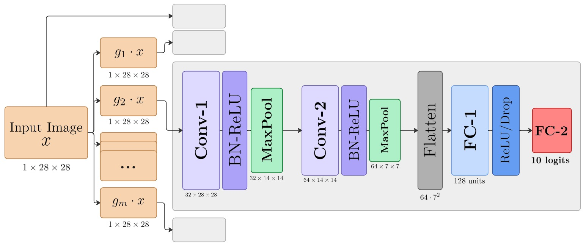

# Training CNN Rotation Robustness: Is Denser Data Augmentation Worth the Cost?

A common way of training convolutional neural networks to better classify rotated images is through data augmentation. In this process, we typically train on $m=1$ additional transformed image per epoch. We explore the tradeoff between the model's increased rotation robustness and training cost when pushing augmentation past $m=1$.

